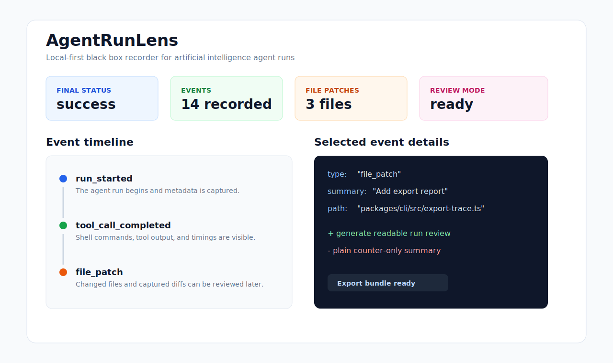

# AgentRunLens

AgentRunLens is a local-first black box recorder for artificial intelligence agent
runs. It records prompts, decisions, tool calls, shell commands, file patches,
failures, retries, and final results into a portable newline-delimited JSON
trace file.

The first release includes a deterministic offline demonstration, an optional
OpenAI demonstration, a local web viewer, and an export command for packaging a
trace with a generated summary.



## 中文介绍

AgentRunLens 是一个面向人工智能代理项目的本地优先黑匣子记录器。它可以把一次代理运行中的提示词、决策过程、工具调用、命令执行、文件修改、失败、重试和最终结果记录成可携带的 newline-delimited JSON 轨迹文件，并通过本地网页查看器清楚展示出来。

这个项目特别适合中国创作者、独立开发者和团队在构建重要人工智能代理项目时使用。比如你正在做一个复杂的自动化开发代理、研究型代理、多代理协作系统，或者一个需要长期维护的开源项目，那么仅仅看到最终代码是不够的。你可能还需要完整复盘项目是怎样一步一步构建出来的：代理调用了哪些工具、哪些地方失败过、哪些文件被修改、哪一步最关键、最终结果是否和目标一致。AgentRunLens 的价值就在这里，它让项目构建过程从“只看结果”变成“过程和结果都可以检查”。

典型使用场景包括：

- 重要项目的全程复盘：记录一次人工智能代理从接收任务到完成交付的完整过程，方便事后检查、总结和分享。
- 代理调试：查看工具调用、文件差异、失败事件和重试过程，快速定位代理为什么偏离目标。
- 开源项目展示：把代理构建过程导出成可以复盘的运行包，让其他人更容易理解项目是怎样被完成的。
- 团队协作审查：当多人共同评估一个代理输出结果时，可以同时查看过程记录，而不是只讨论最终文件。
- 教学和演示：用离线演示快速生成示例轨迹，再通过可视化界面展示人工智能代理的运行链路。

作者已经将 AgentRunLens 做成了 Codex 的本地个人插件，方便在上述场景中直接使用。也就是说，当你在 Codex 里需要演示、查看或导出代理运行记录时，可以通过插件说明让 Codex 自动调用这个项目的命令，而不必每次手动记住完整命令。推荐其他创作者也尝试把自己的代理工具做成本地个人插件：这样既能保留开源项目的独立性，又能让日常使用更顺手。

目前这个插件不会自动记录你所有的 Codex 工作。它更适合在你明确需要记录、复盘、演示或导出某一次重要代理运行时启用。对于真正重要的项目，尤其是需要证明构建过程、分析失败原因、沉淀经验或者公开展示创作过程的项目，AgentRunLens 会非常有必要。

## Use As A Codex Local Personal Plugin

AgentRunLens has also been packaged by the author as a Codex local personal
plugin. In that setup, Codex can use the plugin instructions to run the offline
demonstration, open the local viewer, and export a trace bundle without asking
the user to remember every command.

This is useful when you are working on an important project and want a clear
record of how an artificial intelligence agent helped build it. Instead of only
keeping the final files, you can keep the process: prompts, tool calls, shell
commands, file patches, failures, retries, and the final result.

Example Codex prompts:

```text
Use AgentRunLens to run an offline demonstration.
```

```text
Use AgentRunLens to open the latest trace in the local viewer.
```

```text
Use AgentRunLens to export the latest trace bundle for review.
```

The plugin is local-first. It does not automatically record every Codex task,
and it does not upload trace files by itself. You explicitly choose when a run
should be recorded, reviewed, or exported.

### 作为 Codex 本地个人插件使用

作者已经把 AgentRunLens 做成了 Codex 的本地个人插件，方便在重要项目复盘、代理调试、开源展示和团队审查时直接使用。你可以让 Codex 调用 AgentRunLens 的演示、查看和导出命令，而不用每次手动记住完整命令。

推荐其他创作者也尝试这种方式：把自己的代理工具做成本地个人插件。这样既能保留开源项目的独立性，又能让日常使用更方便，特别适合需要全程记录项目构建过程的重要工作。

## Quickstart

Use this path if you want to try AgentRunLens for the first time and see a
complete local trace in the browser.

### 1. Requirements

- Node.js 20 or newer
- Corepack enabled
- Git

If Corepack is not enabled on your machine, run:

```bash
corepack enable
```

### 2. Clone The Repository

```bash
git clone https://github.com/YYJoseph/agent-run-lens.git
cd agent-run-lens
```

### 3. Install Dependencies

```bash
corepack pnpm install
```

### 4. Build The Project

```bash
corepack pnpm build
```

### 5. Generate An Offline Demonstration Trace

This command runs a deterministic local demonstration. It does not require an
OpenAI key or any network model call.

```bash
corepack pnpm run agent-run-lens -- demo --offline
```

After it finishes, the latest trace should be written to:

```text
examples/traces/latest.trace.jsonl
```

### 6. Open The Local Viewer

```bash
corepack pnpm run agent-run-lens -- view examples/traces/latest.trace.jsonl
```

The command starts a local web viewer and prints a browser address. Open that
address to inspect the recorded agent run timeline, tool calls, file changes,
failures, retries, and final summary.

### 7. Export A Shareable Trace Bundle

```bash
corepack pnpm run agent-run-lens -- export examples/traces/latest.trace.jsonl
```

The export command writes a folder containing the original trace, a generated
summary, captured file diffs, and safe environment metadata. This is useful when
you want to share an agent run with teammates, attach it to an issue, or keep a
record of how an important project was built.

### 快速开始说明

如果你是第一次使用，可以按下面的顺序理解：

第一步，安装项目依赖：

```bash
corepack pnpm install
```

第二步，构建所有工作区包：

```bash
corepack pnpm build
```

第三步，生成一份不依赖网络模型的本地演示轨迹：

```bash
corepack pnpm run agent-run-lens -- demo --offline
```

第四步，打开本地可视化查看器：

```bash
corepack pnpm run agent-run-lens -- view examples/traces/latest.trace.jsonl
```

第五步，导出一份可以分享、归档和复盘的运行包：

```bash
corepack pnpm run agent-run-lens -- export examples/traces/latest.trace.jsonl
```

对于重要项目，建议在关键构建阶段主动运行 AgentRunLens。这样你不仅能保存最终结果，也能保存人工智能代理完成项目时的过程证据，包括它做了什么、为什么失败、如何重试、修改了哪些文件，以及最终交付是否符合目标。

### Copy-Ready Commands

If you already have Node.js, Corepack, and Git installed, you can copy this
whole command group:

```bash
git clone https://github.com/YYJoseph/agent-run-lens.git
cd agent-run-lens
corepack pnpm install
corepack pnpm build
corepack pnpm run agent-run-lens -- demo --offline
corepack pnpm run agent-run-lens -- view examples/traces/latest.trace.jsonl
```

## Optional OpenAI Demonstration

POSIX shells:

```bash
OPENAI_API_KEY=your_key corepack pnpm run agent-run-lens -- demo --openai
```

PowerShell:

```powershell
$env:OPENAI_API_KEY="your_key"; corepack pnpm run agent-run-lens -- demo --openai
```

Command Prompt:

```cmd
set "OPENAI_API_KEY=your_key" && corepack pnpm run agent-run-lens -- demo --openai
```

If `OPENAI_API_KEY` is not set, use the offline demonstration.

## Troubleshooting

If `corepack pnpm install` fails, make sure Node.js 20 or newer is installed and
run `corepack enable` before installing dependencies again.

If `examples/traces/latest.trace.jsonl` does not exist, run the offline
demonstration first:

```bash
corepack pnpm run agent-run-lens -- demo --offline
```

If the local viewer starts but the browser does not open automatically, copy the
printed local address into your browser manually.

If you do not have an OpenAI key, use the offline demonstration. It is designed
for first-time users, project demonstrations, and documentation screenshots.
